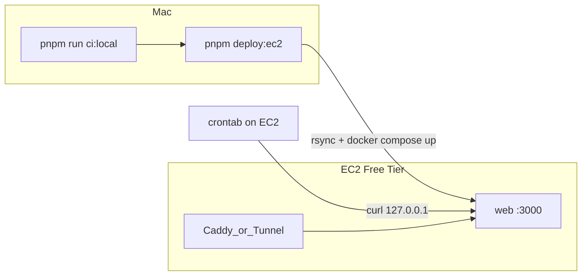

# EC2 Production (local pipeline, no Railway / no external CI)

Deploy AK System to a single AWS EC2 Free Tier instance using Docker Compose, driven
entirely from your Mac. Tests and build run locally (`pnpm run ci:local`); deploy is one SSH command
(`pnpm deploy:ec2`); cron runs on the instance itself.

## Overview



## 1. Launch the instance

- **AMI:** Ubuntu Server 22.04 LTS (or 24.04).
- **Type:** `t3.micro` / `t2.micro` (x86) or `t4g.micro` (arm64) — all Free Tier eligible (~750 h/month for 12 months).
- **Storage:** 20–30 GB gp3 (Free Tier includes 30 GB).
- **Key pair:** create/download an SSH key (e.g. `ak-system.pem`).
- **Elastic IP:** allocate and associate one so the public IP is stable across reboots.

### Security Group (inbound)

| Port | Source | Purpose |
|------|--------|---------|
| 22 | your IP only | SSH |
| 80 | 0.0.0.0/0 | HTTP (Caddy / ACME) |
| 443 | 0.0.0.0/0 | HTTPS (Caddy) |

> Using Cloudflare Tunnel instead of Caddy? You only need port 22 — the tunnel makes outbound connections, so 80/443 can stay closed.

## 2. One-time bootstrap

SSH in and run the bootstrap (installs Docker, a 2 GB swap file, and `/opt/ak-system`):

```bash
ssh -i ak-system.pem ubuntu@<elastic-ip>

# Option A — clone first, then bootstrap from the repo:
git clone https://github.com/<you>/<repo>.git /opt/ak-system
bash /opt/ak-system/scripts/ec2-bootstrap.sh

# Option B — let the deploy script rsync the code later; just bootstrap deps:
REPO_URL=https://github.com/<you>/<repo>.git bash <(curl -fsSL https://raw.githubusercontent.com/<you>/<repo>/main/scripts/ec2-bootstrap.sh)
```

Log out and back in once so your user picks up the `docker` group.

## 3. Production env

On your Mac, generate `deploy/production.env` from your local `.env.local`:

```bash
bash scripts/generate-production-env.sh https://your-domain.com
DEPLOY_CHECK=1 pnpm run ci:local   # validates required vars (or run validate-production-env.sh directly)
```

The deploy script copies `deploy/production.env` to the instance automatically. `NEXT_PUBLIC_APP_URL`
and `NEXTAUTH_URL` must equal the final HTTPS URL (domain via Caddy, or the Cloudflare Tunnel hostname).

## 4. Configure deploy connection

On your Mac, copy and fill the deploy settings:

```bash
cp deploy/ec2.env.example deploy/ec2.env
# DEPLOY_HOST=<elastic-ip>   DEPLOY_USER=ubuntu
# DEPLOY_PATH=/opt/ak-system SSH_KEY=~/.ssh/ak-system.pem
# APP_URL=https://your-domain.com
```

## 5. Deploy

```bash
pnpm deploy:ec2
```

This runs local CI (skip with `SKIP_CI=1`), rsyncs the repo to the instance, runs
`docker compose -f deploy/docker-compose.production.yml up -d --build`, and health-checks the app.

Web runs by default. To also run the WhatsApp bridge (needs more RAM than a 1 GB box
comfortably allows), deploy with the profile on the server:

```bash
ssh ... 'cd /opt/ak-system && docker compose -f deploy/docker-compose.production.yml --profile whatsapp up -d --build'
```

## 6. HTTPS

Pick one:

### Caddy (custom domain)

Point your domain's A record at the Elastic IP, then on the instance:

```bash
sudo apt-get install -y caddy
sudo cp /opt/ak-system/deploy/Caddyfile.example /etc/caddy/Caddyfile
# edit the domain inside, then:
sudo systemctl restart caddy
```

Caddy obtains and renews a Let's Encrypt certificate automatically and proxies `:443 → 127.0.0.1:3000`.

### Cloudflare Tunnel (no domain)

Reuse the repo's tunnel script on the instance (same as the Mac flow):

```bash
sudo apt-get install -y cloudflared   # or the official .deb
cd /opt/ak-system && bash scripts/tunnel.sh
```

Set `NEXT_PUBLIC_APP_URL` / `NEXTAUTH_URL` to the tunnel hostname and redeploy.

## 7. Cron on the instance

Install the server crontab (uses `CRON_SECRET` from `deploy/production.env`):

```bash
cd /opt/ak-system && bash scripts/install-server-cron.sh
```

This replaces GitHub Actions — see [cron-setup.md](./cron-setup.md).

## 8. Google OAuth

Add the redirect URI for your final URL in Google Cloud Console:

```
https://your-domain.com/api/auth/callback/google
```

## Troubleshooting

| Symptom | Fix |
|---------|-----|
| `next build` OOM-killed | Confirm swap is on: `swapon --show`. Re-run `scripts/ec2-bootstrap.sh`. |
| `table not found` | Volume `web-data` mounted at `/data`; container `CMD` runs `db:push` on start. Check `docker compose logs web`. |
| Agent edits lost after redeploy | Volume `abc-data` must be mounted at `/data/abc` with `ABC_ROOT=/data/abc`. Edits from `/agents/manage` persist there; new files from the image are seeded without overwriting. |
| 502 from Caddy | App not up yet: `docker compose -f deploy/docker-compose.production.yml ps` / `logs web`. |
| OAuth redirect mismatch | `NEXTAUTH_URL` must equal the public HTTPS URL and match the Google console redirect. |
