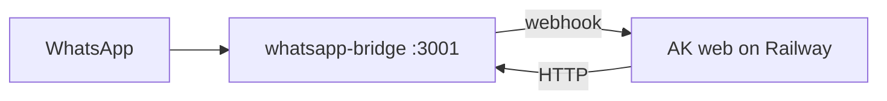

# WhatsApp Bridge on VM (optional, 24/7)

The WhatsApp bridge (`apps/whatsapp-bridge`) uses Baileys and requires **persistent auth state** on disk. It cannot run on ephemeral serverless platforms without a volume.

Use this when you need WhatsApp integration while the Mac is off. **Not required** for Helm chat + Expo push — those work with web-only on Railway.

## Architecture



## Option A: Docker Compose on VPS

Files: [`deploy/docker-compose.production.yml`](../../deploy/docker-compose.production.yml)

### 1. Provision VM

- Hetzner CX22, DigitalOcean Droplet, or similar (1 GB RAM minimum)
- Ubuntu 22.04+, Docker + Docker Compose installed

### 2. Configure env

```bash
cp deploy/railway.env.example deploy/production.env
cp deploy/whatsapp-bridge.env.example deploy/whatsapp-bridge.env
# Edit both files — set secrets, AK_WEBHOOK_URL, WHATSAPP_BRIDGE_URL
```

In `production.env` (web service):

```
WHATSAPP_BRIDGE_URL=http://whatsapp-bridge:3001
WHATSAPP_BRIDGE_SECRET=<same as BRIDGE_SECRET in bridge env>
```

In `whatsapp-bridge.env`:

```
AK_WEBHOOK_URL=https://your-app.up.railway.app/api/whatsapp/webhook
BRIDGE_SECRET=<same secret>
AUTH_STATE_PATH=/data/auth
```

### 3. Start services

```bash
docker compose -f deploy/docker-compose.production.yml up -d
```

### 4. Pair WhatsApp

1. Open `http://<vm-ip>:3001` (or tunnel securely — do not expose publicly without auth)
2. Scan QR code with WhatsApp → Linked Devices
3. Copy self JID from `GET /status` → set `WHATSAPP_ALLOWED_JID` in Railway web env

### 5. Sync rules from web UI

In AK System → Settings → WhatsApp → **Sync rules to bridge**

## Option B: Railway second service

1. Add a second Railway service from the same repo
2. Root Directory: `apps/whatsapp-bridge` (or use bridge Dockerfile)
3. Mount volume at `/data`, set `AUTH_STATE_PATH=/data/auth`
4. Set `AK_WEBHOOK_URL` to the web service public URL
5. Set web service `WHATSAPP_BRIDGE_URL` to the bridge service internal URL

## Option C: Keep bridge on Mac

Run locally when needed:

```bash
pnpm whatsapp-bridge:dev
```

Set Railway `WHATSAPP_BRIDGE_URL` only when Mac bridge is reachable (e.g. via Tailscale). Simplest if WhatsApp 24/7 is not critical.

## Security

- Do not expose port 3001 to the public internet without authentication
- Use a strong `BRIDGE_SECRET` / `WHATSAPP_BRIDGE_SECRET`
- Prefer private network between web and bridge (Docker network or Railway private networking)

## Cron

WhatsApp group summaries use `/api/cron/whatsapp-group-summary` — included in [`deploy/crontab.example`](../../deploy/crontab.example) on EC2 (see [cron-setup.md](./cron-setup.md)).
