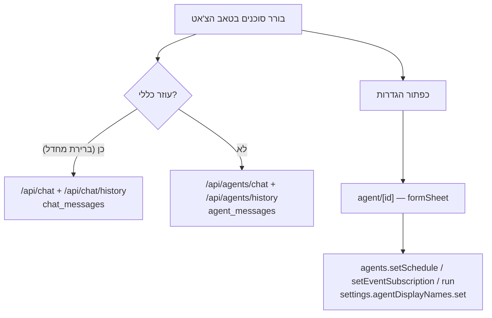

# בורר סוכנים והגדרות סוכן במובייל

> **Slug:** `mobile-agent-picker-and-config`
> **Parent spec:** [`mobile-web-parity.md`](./mobile-web-parity.md) — מחליף את חלק הסוכנים בגל D
> **Status:** Approved — implemented under `mobile-full-parity`
> **Author:** PM Agent
> **Last Updated:** 2026-08-11

## Goal

היום טאב הצ'אט במובייל מדבר רק עם העוזר הכללי (הוגו) דרך `POST /api/chat`, ואין באפליקציה שום דרך לבחור סוכן אחר או לגעת בהגדרות שלו — כל זה קיים רק ב-web תחת `/chat` ו-`/agents/manage`. הספק הזה מביא לטלפון שתי יכולות: **בחירת הסוכן שאיתו מדברים** (עם היסטוריית שיחה נפרדת לכל סוכן, בדיוק כמו ב-web), ו**עריכת ההגדרות התפעוליות של הסוכן** — הפעלה/כיבוי, שעות הרצה, הודעת טריגר, אילו אירועי מערכת מנתבים אליו, שם תצוגה, ו"הרץ עכשיו".

**הבהרת החלטה:** ספק-העל קבע ב-2026-08-11 ש-`/agents/manage` נשאר web-only ("כתיבת פרומפטים ארוכה לא מתאימה לטלפון"). ההחלטה הזו **מתעדכנת חלקית**: ההגדרות התפעוליות עוברות למובייל (הן טופס קצר של toggles וצ'יפים, לא כתיבת פרומפטים), אבל **עריכת ה-markdown של כרטיס הסוכן וה-workflow נשארת web-only** — אושר על ידי המשתמש ב-2026-08-11.

**כמעט אין עבודת backend חדשה:** כל ה-procedures וה-endpoints קיימים. העבודה היא מסכים במובייל + עטיפות, פלוס **תיקון אבטחה חובה** (למטה).

## ממצא אבטחה — חוסם, חייב להיכנס בגל הזה

ארבעת ה-REST routes של הסוכנים **לא בודקים אימות בכלל** — לא session, לא Bearer, שום דבר:

| Route | קובץ | מצב היום |
|---|---|---|
| `GET /api/agents` | `apps/web/src/app/api/agents/route.ts` | ללא אימות |
| `GET`/`PUT /api/agents/[id]` | `apps/web/src/app/api/agents/[id]/route.ts` | ללא אימות — **PUT כותב לקבצי `A_Agents/` ו-`S_Skills/`** |
| `GET /api/agents/history` | `apps/web/src/app/api/agents/history/route.ts` | ללא אימות |
| `POST /api/agents/chat` | `apps/web/src/app/api/agents/chat/route.ts` | ללא אימות — מריץ LLM |

לשם השוואה, `/api/chat` כן מגן על עצמו:

```10:15:apps/web/src/app/api/chat/route.ts
export async function POST(request: NextRequest): Promise<NextResponse> {
  try {
    const session = await getApiSession(request)
    if (!session?.user) {
      return NextResponse.json({ error: 'Unauthorized' }, { status: 401 })
    }
```

האפליקציה חשופה לאינטרנט דרך ngrok, ומכיוון שהגל הזה הופך את הטלפון לתלוי ב-routes האלה — צריך לסגור את זה עכשיו. `getApiSession(request)` פותר את **שתי** הבעיות במכה אחת: הוא חוסם גישה אנונימית **וגם** מקבל את ה-Bearer JWT של המובייל (`sessionFromBearer`), כך שאין צורך במנגנון אימות נפרד לאפליקציה.

## User Stories

- כמשתמש בטלפון, אני רוצה לבחור עם איזה סוכן אני מדבר — עוזר כללי או אחד מהסוכנים ב-`A_Agents/` — ושלכל אחד תהיה היסטוריית שיחה משלו.
- אני רוצה לראות באיזה engine הסוכן רץ (gemini/cursor) בלי לצאת מהאפליקציה.
- אני רוצה להדליק/לכבות הרצה מתוזמנת לסוכן, לשנות את שעות ההרצה ואת הודעת הטריגר — מהטלפון.
- אני רוצה להחליט אילו אירועי מערכת (תדריך בוקר, הכנה לפגישה, תזכורת משימות, סיכום יומי) ינותבו לאיזה סוכן.
- אני רוצה לתת לסוכן שם תצוגה משלי, ולראות מתי הוא רץ לאחרונה ואם זה הצליח.
- אני רוצה להריץ סוכן ידנית ("הרץ עכשיו") ולקבל את התוצאה.

## Acceptance Criteria

### אבטחה (חוסם)
- [ ] ארבעת ה-routes תחת `apps/web/src/app/api/agents/**` קוראים `getApiSession(request)` ומחזירים `401 {"error":"Unauthorized"}` ללא session תקף — באותו דפוס כמו `apps/web/src/app/api/chat/route.ts`.
- [ ] בקשה מהמובייל עם `Authorization: Bearer <jwt>` עוברת בכל אחד מהארבעה.
- [ ] `POST /api/agents/chat` מעביר `channel` אמיתי ל-`runAgentForUser` לפי `clientChannel(request)` (`X-AK-Client: helm` → `'mobile'`) במקום `'web'` הקבוע היום (שורה 41 בקובץ).

### בורר סוכנים בצ'אט
- [ ] טאב הצ'אט מציג בורר סוכנים; **"עוזר כללי" הוא ברירת המחדל** ומתנהג בדיוק כמו היום (`/api/chat` + `/api/chat/history`, טבלת `chat_messages`).
- [ ] רשימת הסוכנים מגיעה מ-`GET /api/agents` ומציגה `name` (שם התצוגה, לא ה-id) ו-`role`.
- [ ] בחירת סוכן ספציפי טוענת את ההיסטוריה שלו מ-`GET /api/agents/history?agentId=<id>` ושולחת דרך `POST /api/agents/chat` — כלומר טבלת `agent_messages`, נפרד לחלוטין מהעוזר הכללי.
- [ ] ה-engine (`gemini`/`cursor`) מוצג כאינדיקציה קטנה לקריאה בלבד.
- [ ] הסוכן הנבחר נשמר בין הפעלות (AsyncStorage/SecureStore באותו דפוס כמו `lib/auth.tsx`), כדי שלא צריך לבחור מחדש בכל כניסה.
- [ ] `POST /api/agents/chat` יכול לרוץ עד 5 דקות (`maxDuration = 300`). ה-UI מציג מחוון "חושב…" לאורך כל הזמן הזה, ומגיע ל-timeout מנוהל עם הודעה בעברית במקום להיתקע לנצח.

### מסך הגדרות סוכן
- [ ] מסך `agent/[id]` (formSheet, מבוסס `FormSheetScaffold`) מציג ומאפשר לערוך:
  - [ ] **הרצה לפי שעה** — toggle (`enabled`)
  - [ ] **שעות** — צ'יפים של `scheduleTimes` עם הוספה דרך `@react-native-community/datetimepicker` (mode `time`) ומחיקה; כפתור "השתמש במוצע" ממלא מ-`suggestedScheduleTimes`
  - [ ] **הודעת טריגר** — טקסט רב-שורתי (`triggerMessage`, עד 4000 תווים); placeholder מציג את `defaultTriggerMessage`
  - [ ] **אירועים** — checkbox לכל אירוע מ-`events` (רק `routable`), מסומן לפי `subscribedEvents`
  - [ ] **שם תצוגה** — שדה טקסט (עד 40 תווים), שמירה דרך `settings.agentDisplayNames.set`
  - [ ] **הרצה אחרונה** — `lastRunAt` בעברית + סטטוס; אם `lastRunStatus === 'error'` מוצג `lastRunError`
  - [ ] **הרץ עכשיו** — כפתור שקורא `agents.run`
- [ ] שמירה מפעילה `agents.setSchedule` פעם אחת, ו-`agents.setEventSubscription` רק לאירועים שהשתנו בפועל (diff), בדיוק כמו `AgentConfigPanel` ב-web.
- [ ] ניסיון להפעיל לוח זמנים בלי אף שעה מציג את שגיאת ה-`BAD_REQUEST` מהשרת ("יש להגדיר לפחות שעה אחת כדי להפעיל לוח זמנים") ולא נשמר.
- [ ] אירוע מנותב לכל היותר לסוכן אחד — סימון אירוע שכבר מנותב לסוכן אחר מציג אזהרה שהוא ייגזל ממנו (`routedAgentId` מגיע ב-`events`).

### ניווט ונקודות כניסה
- [ ] מסך `agents` (Stack) — רשימת כל הסוכנים; כל שורה מציגה שם, role, סטטוס תזמון (מופעל/כבוי + שעות) והרצה אחרונה. לחיצה פותחת את `agent/[id]`.
- [ ] `(tabs)/more.tsx` מקבל כניסה חדשה במערך `ENTRIES`: `🤖 סוכנים` → `/agents`.
- [ ] מטאב הצ'אט אפשר להגיע ישירות להגדרות של הסוכן הנבחר (כפתור ⚙ בהדר; מושבת כשנבחר "עוזר כללי").
- [ ] `MobileNotificationRoute` ב-`apps/mobile/lib/api.ts` מורחב ל-`/agents`, ו-`mobileRouteForNotificationUrl` ממפה `/agents` ו-`/agents/manage` → `/agents` (היום שניהם נופלים בשקט ל-`/`).

### רוחבי
- [ ] RTL מלא, ערכת ה-navy הכהה, ושימוש בקומפוננטות הקיימות: `Card`, `FilterChips`, `SectionHeader`, `EmptyState`, `FormSheetScaffold`, `StatusPill`, `RtlRow`.
- [ ] יעדי מגע ≥44pt, `accessibilityLabel` בעברית לכל פקד.
- [ ] `pnpm --filter @ak-system/mobile lint` (`tsc --noEmit`) עובר; `pnpm test` נשאר ירוק.

## Data Model

**אין שינויי סכימה** — לא ב-`packages/database/src/schema.ts` ולא ב-`schema.pg.ts`. כל הטבלאות הדרושות קיימות:

| טבלה | תפקיד בגל הזה |
|---|---|
| `agent_schedules` | `enabled`, `schedule_times` (JSON), `trigger_message`, `last_run_at`, `last_run_status`, `last_run_error` |
| `notification_preferences.agent_id` | ניתוב אירוע → סוכן (אירוע אחד ⇐ סוכן אחד) |
| `agent_messages` | היסטוריית שיחה פר-סוכן (`agent_id`, `role`, `content`, `created_at`) |
| `agent_threads` | `cursor_agent_id` — רק כשה-engine הוא cursor |
| `user_settings.agent_display_names` | מפת JSON של שמות תצוגה |
| `chat_messages` | נשאר של העוזר הכללי בלבד |

הגדרות הסוכנים עצמן הן קבצי markdown ב-`A_Agents/*.md` שנקראים ב-runtime (`listAgentSummaries`) — לא DB, ולא נכתבים בגל הזה.

## tRPC API

**אין procedures חדשים.** הכל קיים כ-`protectedProcedure` (ולכן כבר עובד עם Bearer של המובייל):

| Procedure | סוג | Input (Zod, כפי שקיים) | Output |
|---|---|---|---|
| `agents.list` | query | — | `{ agents: AgentScheduleConfig[]; events: RoutableEventSummary[] }` |
| `agents.setSchedule` | mutation | `{ agentId: string.min(1), enabled?: boolean, scheduleTimes?: string[].max(24) /* HH:MM */, triggerMessage?: string.max(4000) \| null }` | `AgentScheduleConfig` |
| `agents.setEventSubscription` | mutation | `{ agentId: string.min(1), typeId: string.min(1), subscribed: boolean }` | `{ typeId: string; routedAgentId: string \| null }` |
| `agents.run` | mutation | `{ agentId: string.min(1) }` | `{ ok: boolean; text?: string; error?: string }` |
| `settings.agentDisplayNames.set` | mutation | `{ agentId: string.min(1), displayName: string.max(40) \| null }` | `{ names: Record<string,string> }` |

טיפוסי המקור (`packages/api/src/services/agent-schedules.ts:33-56`):

```33:56:packages/api/src/services/agent-schedules.ts
export interface AgentScheduleConfig {
  agentId: string
  name: string
  role: string
  enabled: boolean
  scheduleTimes: string[]
  triggerMessage: string | null
  defaultTriggerMessage: string
  suggestedScheduleTimes: string[]
  subscribedEvents: string[]
  lastRunAt: string | null
  lastRunStatus: string | null
  lastRunError: string | null
}

export interface RoutableEventSummary {
  typeId: string
  label: string
  description: string
  schedulable: boolean
  scheduleTimes: string[]
  routedAgentId: string | null
  suggestedAgentId: string | null
}
```

ארבעת האירועים הניתנים לניתוב (`routable: true` ב-`NOTIFICATION_TYPES`): `morning_briefing`, `task_reminder`, `pre_meeting_briefing`, `daily_meeting_summary`.

**REST (קיים, אחרי תיקון האימות):** `GET /api/agents` → `{ agents: [{id,name,role,defaultName}], engine }`; `GET /api/agents/history?agentId=` → `{ messages }`; `POST /api/agents/chat` `{ agentId, message }` → `{ assistantMessage, engine, cursorAgentId? }`.

**שינוי backend יחיד מעבר לאימות:** `channel` דינמי ב-`/api/agents/chat` (ראו Acceptance Criteria).

## UI Surface

כל הקבצים תחת `apps/mobile/`:

| קובץ | שינוי |
|---|---|
| `app/(tabs)/chat.tsx` | בורר סוכנים + מסלול שליחה/היסטוריה כפול (כללי מול סוכן) + אינדיקציית engine + ⚙ להגדרות |
| `app/agents.tsx` | **חדש** — Stack, רשימת סוכנים עם סטטוס תזמון והרצה אחרונה |
| `app/agent/[id].tsx` | **חדש** — formSheet, טופס ההגדרות התפעוליות |
| `app/_layout.tsx` | רישום `agents` (title: 'סוכנים') ו-`agent/[id]` (presentation: 'formSheet', title: 'הגדרות סוכן') |
| `app/(tabs)/more.tsx` | כניסה חדשה ב-`ENTRIES`: `{ icon: '🤖', label: 'סוכנים', route: '/agents' }` |
| `lib/api.ts` | `fetchAgents`, `fetchAgentHistory`, `sendAgentMessage` (REST, דפוס `apiFetch` הקיים) + הרחבת `MobileNotificationRoute` ל-`/agents` |
| `lib/data.ts` | עטיפות tRPC חדשות: `fetchAgentConfigs`, `setAgentSchedule`, `setAgentEventSubscription`, `runAgent`, `setAgentDisplayName` + טיפוסי `MobileAgentConfig` / `MobileRoutableEvent` (typed ידנית, בלי לייבא `AppRouter` — כמו כל השאר בקובץ) |

**זרימת הצ'אט אחרי השינוי:**



**הערת תהליך:** לבדוק את גרסאות Expo מול https://docs.expo.dev/versions/v56.0.0/ לפני כתיבת קוד מובייל (`apps/mobile/AGENTS.md`).

## Out of Scope

| מה | למה |
|---|---|
| עריכת markdown של כרטיס הסוכן (`A_Agents/*.md`) ושל ה-workflow (`S_Skills/*.md`) | נשאר web-only — החלטת המשתמש 2026-08-11. ה-`PUT /api/agents/[id]` לא ייקרא מהמובייל בכלל |
| בחירת engine (gemini/cursor) | נקבע מ-env בלבד (`getAgentEngine`), אין לזה UI גם ב-web |
| יצירה/מחיקה של סוכנים | סוכן = קובץ markdown; אין לזה API |
| ערוצי התראות פר-סוג (`/settings/notifications`) | מסך נפרד; הגל הזה נוגע רק בעמודת `agent_id` |
| מסכי `memory` ו-`updates` | שאר גל D — ספק נפרד |
| Streaming של תשובת הסוכן | ה-endpoint מחזיר תשובה אחת בסוף; שינוי לזרימה הוא שינוי backend נפרד |
| Push על סיום הרצת סוכן | קיים כבר דרך מנגנון ההתראות הרגיל |

## Open Questions

1. **"הרץ עכשיו" ארוך** — `agents.run` יכול לרוץ דקות. עדיף (א) להמתין עם ספינר וחסימת המסך, או (ב) לשגר ולהודיע "הסוכן רץ ברקע, התוצאה תגיע בהתראה"? ההמלצה שלי: (ב) עם timeout של 60 שניות ואז מעבר להודעת רקע — חוויה טובה יותר בסלולר.
2. **מיקום הבורר** — צ'יפים אופקיים בראש הצ'אט (נגיש בקליק אחד, תופס גובה) או bottom-sheet שנפתח מכפתור בהדר (נקי יותר, קליק נוסף)? עם 8+ סוכנים אני נוטה ל-bottom-sheet.
3. האם למחוק היסטוריית שיחה של סוכן מהטלפון (כפתור "נקה שיחה")? אין היום procedure כזה — יחייב תוספת backend.
