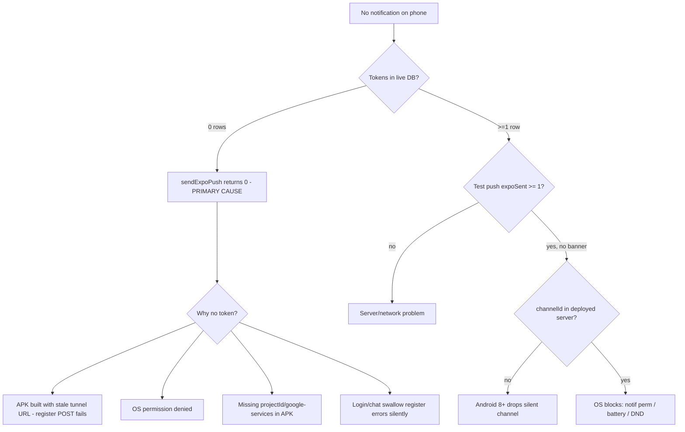

# QA report — helm-push (ARO mobile push notifications)

**Detected stack:** next-trpc-monorepo
**Verdict:** FAIL — no push can be delivered in the current state.

## Bottom line

The phone receives no notification because **zero Expo push tokens are registered in the database the live server uses**. `sendExpoPush` returns early (`rows.length === 0 -> return 0`), so nothing is ever sent to Expo/FCM — independent of OS settings, FCM config, or channelId. This is the primary root cause. A secondary risk (channelId on a deployed build) is described below.

## Evidence gathered (server-side, read-only)

- **FCM V1 on EAS:** PASS — `scripts/check-helm-fcm.sh` -> `FCM V1 present (OK:helm-push-969711)`.
- **`google-services.json`:** present locally (`apps/mobile/google-services.json`, `com.alpir.helm`).
- **Live backend reachability:** `GET https://attach-special-bar-intend.trycloudflare.com/api/health` -> **HTTP 200**. Tunnel is alive.
- **Live backend location:** a Next server is listening locally on `:3000` (pid 18619); the Cloudflare tunnel fronts this machine. Effective DB is the default `./data/ak_system.sqlite` (no `DATABASE_PATH` in the running dev env).
- **Registered tokens:** `SELECT count(*) FROM expo_push_tokens` = **0** in both `./data/ak_system.sqlite` and `./apps/web/data/ak_system.sqlite`.
- **APK target URL:** `apps/mobile/.env` and `eas.json` -> `EXPO_PUBLIC_API_URL=https://attach-special-bar-intend.trycloudflare.com` (an **ephemeral** Cloudflare quick-tunnel URL — changes whenever the tunnel restarts).
- **`channelId: 'default'` + `priority: 'high'`:** present in the working tree (`packages/api/src/lib/expo-push.ts`) but **not committed** — last commit touching the file (`60b9a45`) predates the change. The running dev server picks it up from the working tree; any separately deployed/committed build would not.

## Root-cause decision tree

## Failures

- `expo_push_tokens` table empty in the live DB -> `packages/api/src/lib/expo-push.ts:27` returns `0`, no send attempted.
- The installed APK almost certainly targets an **older** Cloudflare quick-tunnel URL than the currently-live one, so its `POST /api/push/expo/register` never reaches this server. Quick-tunnel URLs are not stable across restarts.

## What Dev must do next (not part of QA)

Priority order:

- **P0 — get a token registered.** On the phone: Settings -> "הפעל התראות Push" and read the exact status line. That message disambiguates permission vs token vs server error. Then re-check `SELECT count(*) FROM expo_push_tokens`.
- **P0 — stabilize the backend URL.** The ephemeral `trycloudflare.com` URL breaks registration whenever it rotates. Use a stable URL (named tunnel or production host) baked into the APK; rebuild after any URL change.
- **P0 — ensure the deployed server includes `channelId`/`priority`.** For the local-tunnel setup this is already live via the working tree; commit `expo-push.ts` so any deploy carries it.
- **P1 — surface registration failures in the UI.** `app/login.tsx` and `app/(tabs)/chat.tsx` swallow `syncPushToken` errors with `console.warn`; the user gets no signal that registration failed. Settings is the only recovery path.
- **P1 — commit `apps/mobile/google-services.json`** (or guarantee it is present on the EAS build worker) so production builds initialize FCM.

## Notes

- QA made no source changes. Only this report was written.
- No server was spawned by QA; the existing dev server on `:3000` was only probed via the public health endpoint.
- The Settings "שלח בדיקה" button bypasses per-type notification preferences, so it is the cleanest end-to-end probe once a token exists. Real events (`hugo_reply`, `agent_run`, etc.) additionally require the push channel enabled in web notification preferences.
