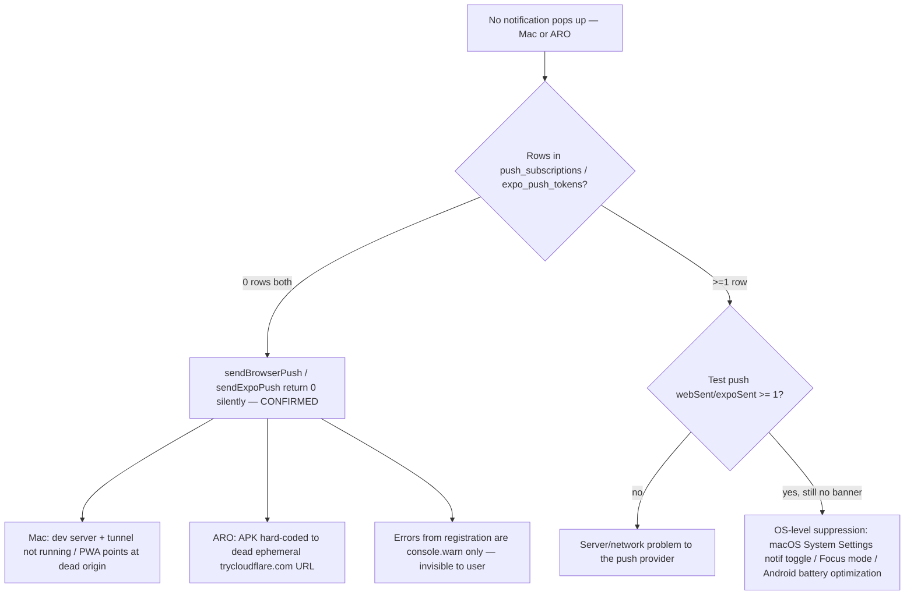

# QA report — push-notifications-not-popping

**Detected stack:** next-trpc-monorepo
**Verdict:** FAIL (environment/config) — no code regression found; **zero devices are currently registered to receive a push on either channel**, so nothing can ever pop up regardless of OS-level permission state.

This re-validates and extends the earlier `reports/qa-helm-push.md` finding — the underlying condition it flagged (dead ephemeral tunnel → 0 registered devices) has **not** been fixed, and the web app now has the identical symptom.

## Bottom line

"Permission granted" (Notification.permission in the browser / `Notifications.getPermissionsAsync()` on the phone) is a **device-local** check — it says nothing about whether the server ever received a subscription/token to push to. Both delivery functions early-return `0` with **no error, no log** when there's nothing to send to:

```25:27:apps/web/src/lib/web-push.ts
  const db = getDb()
  const subs = await db.select().from(pushSubscriptions).all()
  if (subs.length === 0) return 0
```

```25:27:packages/api/src/lib/expo-push.ts
  const db = getDb()
  const rows = await db.select().from(expoPushTokens).all()
  if (rows.length === 0) return 0
```

That's why everything "looks fine" (permission shows granted, `/api/push/test` returns `200`, an in-app notification row is still written via `createNotification`) while nothing ever reaches a device.

## Evidence gathered (read-only)

- **Live DB** (per `DATABASE_PATH` in `apps/web/.env.local` → `apps/web/data/ak_system.sqlite`):
  - `select count(*) from push_subscriptions` → **0**
  - `select count(*) from expo_push_tokens` → **0**
  - `notifications` (in-app center) has 162 rows but the newest is **2026-07-02** — no agent/cron notification has fired in ~4 weeks either, consistent with the server not running continuously.
- **No AK_system dev server is currently running.** `:3000` is bound by an unrelated project (`algo4-portal`'s `next dev`), not this repo's `apps/web`.
- **No `cloudflared` process is running.** `ps aux` shows no tunnel.
- **The ARO (Helm) mobile app is built against an ephemeral Cloudflare quick-tunnel URL:**
  ```
  apps/mobile/.env:        EXPO_PUBLIC_API_URL=https://attach-special-bar-intend.trycloudflare.com
  apps/mobile/eas.json:    "EXPO_PUBLIC_API_URL": "https://attach-special-bar-intend.trycloudflare.com"
  ```
  Quick-tunnel hostnames (`*.trycloudflare.com` from `cloudflared tunnel --url`) are **randomly regenerated every time the tunnel restarts** — they are not stable.
- **The web app's own env was reverted away from that same tunnel URL on 2026-07-27** (untracked backup file left behind by `scripts/set-tunnel-url.sh`):
  ```
  apps/web/.env.local.bak-urls-20260727191741:  NEXTAUTH_URL=https://attach-special-bar-intend.trycloudflare.com
  apps/web/.env.local (current):                NEXTAUTH_URL=http://localhost:3000
  ```
  This confirms that specific tunnel hostname is stale/dead — the exact URL the installed ARO APK is hard-coded to call.
- **Error handling on mobile silently swallows registration failures:**
  ```59:67:apps/mobile/app/(tabs)/chat.tsx
  syncPushToken(token)
    .then((registered) => {
      setPushNotice(registered ? null : 'התראות לא פעילות — הפעל אותן בהגדרות')
    })
    .catch((err) => {
      console.warn('[aro] push token sync failed:', err)
      setPushNotice('רישום התראות נכשל — נסה שוב מההגדרות')
    })
  ```
  and `apps/mobile/app/login.tsx` similarly only `console.warn`s. The one visible signal is a small in-app banner the user can easily miss, plus the exact dead URL shown under Settings → "שרת" in the app.

## Root-cause decision tree



## Per-phase results

### 1. Static / unit tests
`pnpm run pretest && pnpm --filter @ak-system/api run test` → **230/230 passed** (25 files), including the new `src/lib/expo-push.test.ts` (6 tests) added by this pass and the existing `src/routers/push.test.ts` (11) / `src/routers/notifications.test.ts` (4).

### 2. Lint
- `apps/mobile` (`tsc --noEmit`): **PASS**
- `apps/whatsapp-bridge` (`tsc --noEmit`): **PASS**
- `apps/web` (`next lint`): **pre-existing gap, unrelated to this issue** — no ESLint config file exists in `apps/web/`, so `next lint` drops into an interactive "how would you like to configure ESLint" prompt and fails non-interactively. Not caused by this investigation; flagging for the Reviewer/Dev Agent to address separately.

### 3. Build
Not run — no production code was changed (only a new test file added).

## Failures

- `push_subscriptions` and `expo_push_tokens` both empty in the live DB → both send paths return `0`, no push ever attempted. (`apps/web/src/lib/web-push.ts:35`, `packages/api/src/lib/expo-push.ts:27`)
- ARO's baked-in `EXPO_PUBLIC_API_URL` is a dead ephemeral tunnel URL → `POST /api/push/expo/register` (and every other API call from the phone) cannot reach the server.
- No AK_system server / tunnel is currently running on this Mac at all.

## What to do next (not part of QA — for the user / Dev Agent)

Priority order:

1. **Start the server and get a stable URL.**
   - `pnpm dev` (or `bash scripts/dev.sh`) to bring `apps/web` up on `:3000`.
   - For the Mac PWA, just use `http://localhost:3000` directly — no tunnel needed. Re-open Settings → "הפעל נוטיפיקציות" and confirm the status message says success, **then re-check `select count(*) from push_subscriptions`** — don't rely on the permission pill alone.
   - For ARO, you need a **stable** URL reachable from your phone (Cloudflare **named** tunnel, not quick tunnel — see `scripts/tunnel.sh`'s "Named tunnel" mode — or a real deployment). Rebuild/re-run the APK with that URL in `EXPO_PUBLIC_API_URL` / `eas.json` any time the URL changes; quick tunnels will keep breaking this.
2. **On the phone, open Settings → "שרת" and confirm it shows a URL you know is currently live**, then tap "הפעל התראות Push" / "רענן רישום Push" and read the exact status line — it disambiguates permission-denied vs. no-token vs. server-unreachable. Re-check `expo_push_tokens` afterward.
3. **Check macOS System Settings → Notifications for your browser app** (Chrome/Safari) and confirm banners/alerts are enabled and Focus/Do Not Disturb is off — the website's own "granted" permission is a separate layer from the OS notification-center toggle.
4. **Once both tables show ≥1 row**, use Settings → "שלח בדיקה" (web) / "שלח בדיקה" (ARO) — it bypasses per-type preferences and is the cleanest end-to-end probe.
5. Longer-term: surface `syncPushToken`/`registerPush` failures more visibly in the UI instead of `console.warn`, so a dead backend URL doesn't fail invisibly next time.

## Notes

- QA made no production source changes — only this report and one new test file (`packages/api/src/lib/expo-push.test.ts`).
- No server was spawned by QA.
